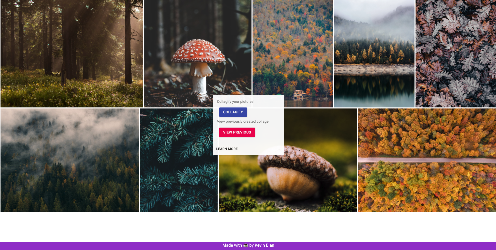
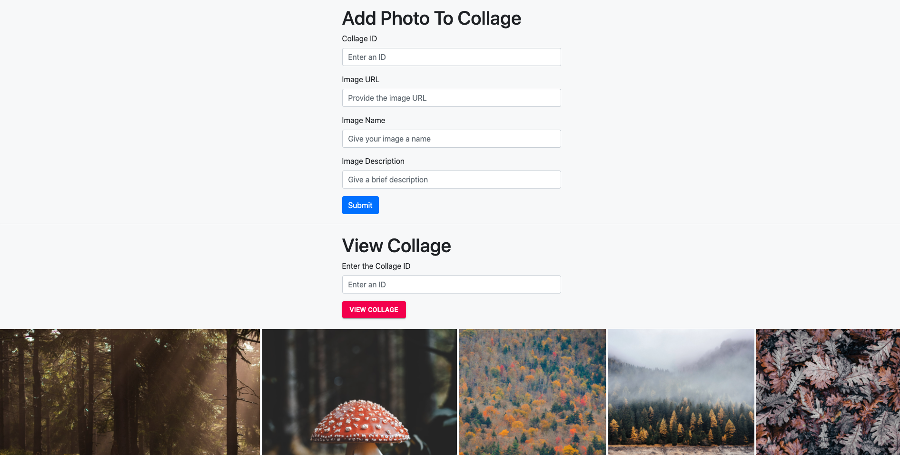
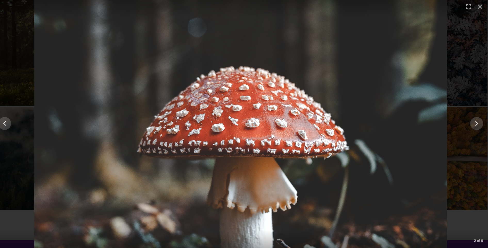
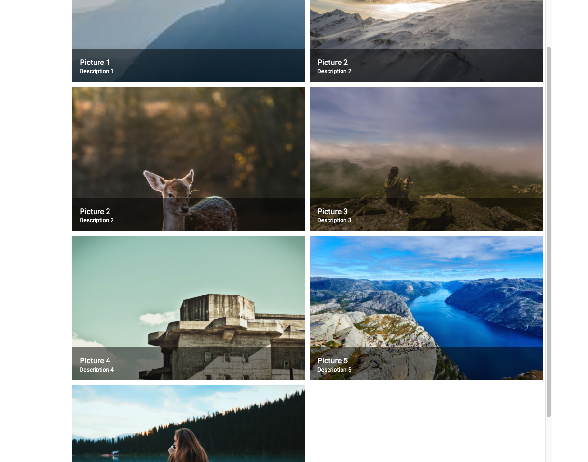
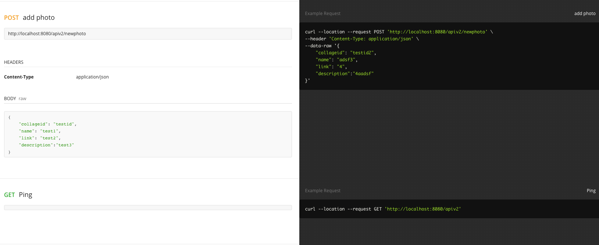
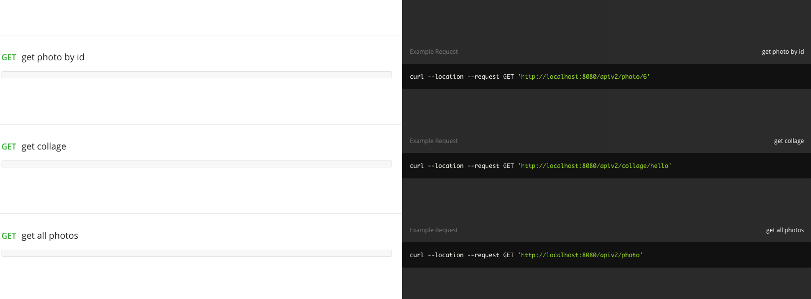
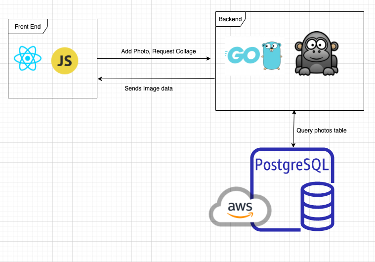

# Collageify

Add photos, create your personal collage. Share the URL with your friends so they can see it too!

Collageify makes use of V2 of Bian Photography API to manage photo information.

## Features Include
- URL sharing (send your create collage to others)
- Lightweight PostgreSQL photo information storage
- Labelling for photos
- Full screen and carosel view for photos

# Front End

Landing Page



Create 



View



List View



# Back End

Postman 1



Postman 2



Design



# Stack
- Go
- PostgreSQL
- React
- Node
- Javascript
- HTML/CSS

# Start

```
# Backend
cd backend/src
go run main.go

# Front end
cd frontend
npm start
```

Make sure to update front end request origins to point to backend URL. 

Also set env variable for PostgreSQL

## Postgres (Currently Running on AWS)
```
docker run -it -p 5432:5432 -d postgres
```

### Create TABLE
```
CREATE TABLE photos (
    photoid SERIAL PRIMARY KEY,
    collageid TEXT,
    name TEXT,
    link TEXT,
    description TEXT
);
```
